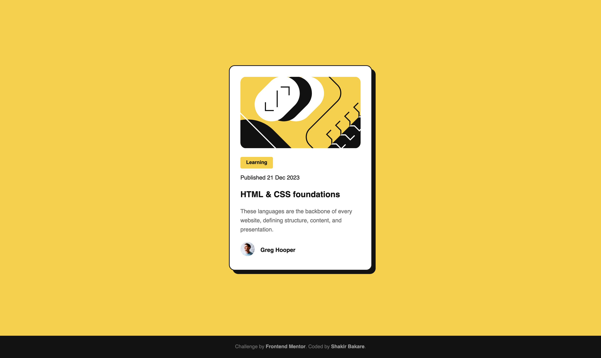

# Frontend Mentor - Blog preview card solution

This is a solution to the [Blog preview card challenge on Frontend Mentor](https://www.frontendmentor.io/challenges/blog-preview-card-ckPaj01IcS). Frontend Mentor challenges help you improve your coding skills by building realistic projects.

## Table of **contents**

- [Frontend Mentor - Blog preview card solution](#frontend-mentor---blog-preview-card-solution)
  - [Table of **contents**](#table-of-contents)
  - [Overview](#overview)
    - [The challenge](#the-challenge)
    - [Screenshot](#screenshot)
    - [Links](#links)
  - [My process](#my-process)
    - [Built with](#built-with)
  - [Author](#author)

## Overview

### The challenge

Users should be able to:

- See hover and focus states for all interactive elements on the page

### Screenshot

### Links

- [Solution URL](https://github.com/shakirbakare/blog-preview-card)
- [Live Site URL](https://shakirbakare.github.io/blog-preview-card)

## My process

### Built with

- Love
- Semantic HTML5 markup
- CSS custom properties
- Flexbox
- @font-face rule
- Sass
- BEM

## Author

- Frontend Mentor - [@shakirbakare](https://www.frontendmentor.io/profile/shakirbakare)
- Twitter - [@shakirbakare](https://www.twitter.com/shakirbakare)
